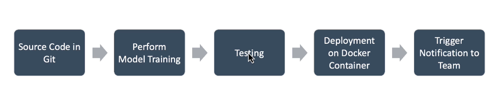

# Working with CI/CD tools Jenkins

## Continuous integration
It is the process of automating the building and testing of code, each time a team member commits the changes to version control system. 

# Example tools 
* GitLab CI
* Jenkins
* CodeShip
* Bamboo
* Travis CI
* Teamcity

## Intro to Jenkins
A CI server which manages and control processes such as plan, code, build, test, deploy, operate and monitor in DevOps Env. It is Open Source. 

### Features of Jenkins
* Easy installation and configuration
* Pipeline as Code
* Monitoring and Reporting
* Notification
* Artefact management
* Env Provisioning

## Project Flow/Example

Git is used as version control. A notification can be sent when a new version code has been uploaded to Git. Webhook can be configured to trigger notification of new code, to Jenkins. Jenkins create a pull request for the latest version of the code. (CI Step)

Once CI step has been implemented, the model can be trained (training step). Which leads to the testing of the model, which can be done using pydantic. 

If the new version passes the test, the model can be deployed to docker container, change the version of model. A notification is sent to the team, about the model update. 

**The course shows how to work with CI/CD flow using Git, Jenkins, dockers and AWS.**