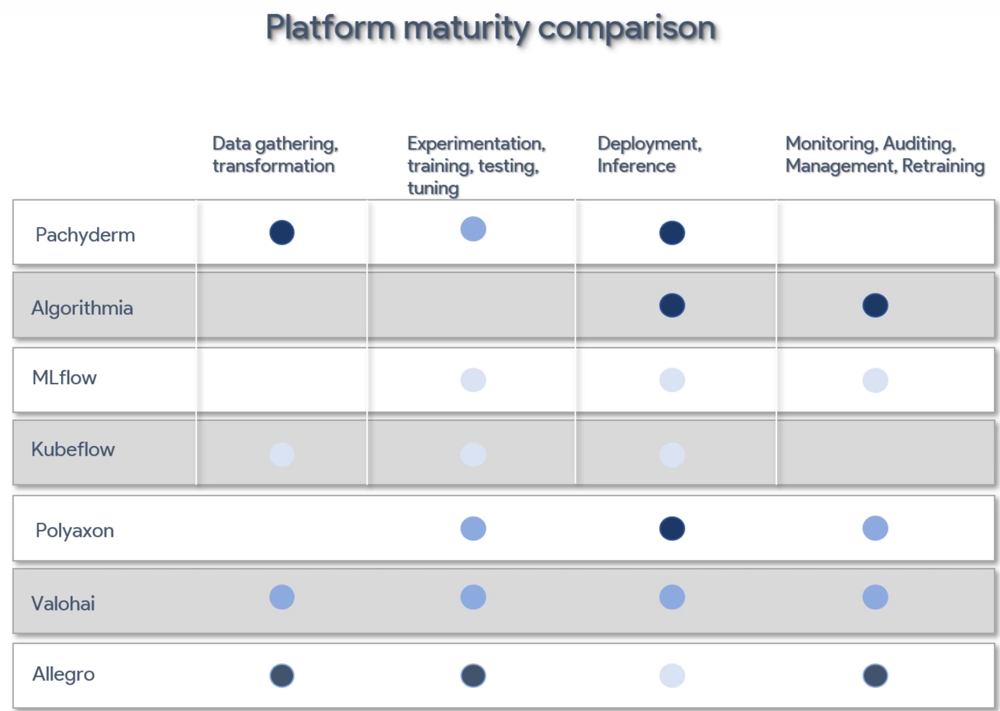
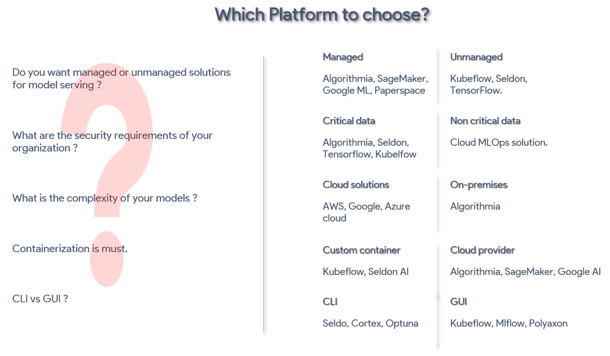
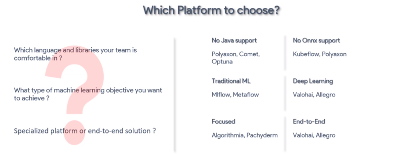

# What is ML ops?

ML Ops is a set of principles and practices to standardize and streamline  the machine learning lifecycle management.

## What is CI/CD workflow.?
A CI/CD workflow for ML pipelines can be described with the following two concepts:

* Pipeline continuous integration, which consists of automated building and testing
* Pipeline continuous delivery, which consists of automated pipeline deployment for continuous training and delivery of ML models

### Pipeline CI [[ref]](https://www.iguazio.com/glossary/ci-cd-for-machine-learning/#:~:text=A%20CI%2FCD%20workflow%20for,and%20delivery%20of%20ML%20models)
The pipeline CI process consists of three stages: 
* development,
* build, and
* testing

The ML pipeline and its components are built, tested, and packaged for delivery when changes are made on the source code repository (usually Git-based). 

During the development process, you iteratively experiment with new ML algorithms and modeling approaches where the experiment steps are orchestrated and tracked. You can then select an appropriate model and push the source code of the ML pipeline to the source code repository.

When changes are detected in the source code repository, it triggers a Git-based CI/CD workflow that starts the automated CI/CD pipeline process. During the build stage, the ML pipeline and its components are built with its dependencies in the form of packages, container images, and executables.

### Pipeline CD [[ref]](https://www.iguazio.com/glossary/ci-cd-for-machine-learning/#:~:text=A%20CI%2FCD%20workflow%20for,and%20delivery%20of%20ML%20models)

During the Pipeline continuous delivery (CD) process, the CI/CD pipeline continuously deploys new ML pipeline implementations that in turn perform continuous training (CT) of ML models for prediction.

During CT of the ML model in the pipeline CD process, the deployed ML pipeline is automatically triggered for model retraining in production based on triggers from the live ML pipeline environment. Model retraining could be triggered either per a schedule, due to model performance degradation, or due to significant changes in data distributions of the features used for prediction (also known as concept drift). The trained ML model is then automatically deployed as a model prediction service as part of the model CD process.

Continuous monitoring of your model’s performance based on live data in production enables the detection of model performance degradations and concept drift so that the CT pipeline can be automatically triggered to retrain and deploy an updated ML model based on more recent data.

## ML Ops Tools/Platforms Stack

A ML Ops life cycle contains 3 stages:
* Data Gathering & preparation
* Modeling
* Deployment 

### Platform Requirements 

**Data gathering & preparation** cannot be done manually, it has to be automated. A pipeline needs to be built that streams in data, and prepares it (by the required means).

**Source Control** is used to control the version of code, data, ML models and artefacts. 

**Experimentation** - The platform should not be limited to a specific team and only use specific tools. It should allow usage of at minimum the popular libraries/tools such as:
* PyTorch 
* TensorFlow
* Keras 
* ...
The platform should the hosting of notebook for development, allowing for rapid development and to keep track of results from experiments. 

**Hyper-parameter Tuning** - The platform needs to contains a hyper-parameter optimisation framework to deliver the best parameters, by identifying the best combination of hyper-parameters. Which deliver the best performance. 

**Distributed Model Training** - The platform should provide have auto scaling and distributed mode training, as GPUs may be required for days or weeks. CI/CD tools for scheduling, task queueing. Selection of reusable components. It should also have the capability to integrate with popular container service and orchestration of batch jobs, like dockers and kubernetes. 

**Auto ML** - The platform should have model training with different permutations and combinations of algorithm data features. 

**Deployment** - Automated deployment using container services like Docker or Kubernetes. These service will allow for scaling. 

###### Model Servers Requirements
* Fall Back support - Fall back to a working version
* Easy Scale out
* Canary A/B framework
* Co-locate multiple models
* Security  

**Model Registry** - This is the registry of training data, model type, artefacts, training parameter, hyper-parameters, performance metrics (accuracy, precision, etc...)

**Feature Store** - To Facilitate collaboration between teams. Reduce duplication, reduce feature engineering cost per model.

**Monitoring** - Should show real-time performance view of deployed models. Should have alert mechanisms.

**Governance** - Governance Service to control access, implement policy and track model activity. Capability to track end-to-end trail of ML assets. 

**Complain & Audit Services** - Authorisation and authentication. Allows the review of model by interal or external auditors. 

### Platform Comparisons 

This comparison is shown in the course. The darkness of the dot show the maturity of the models. These aren't the best options, these are just used for examples.

### Platform to choose?

There are further question that need to be asked, question related to the projects and teams compatibilities. 