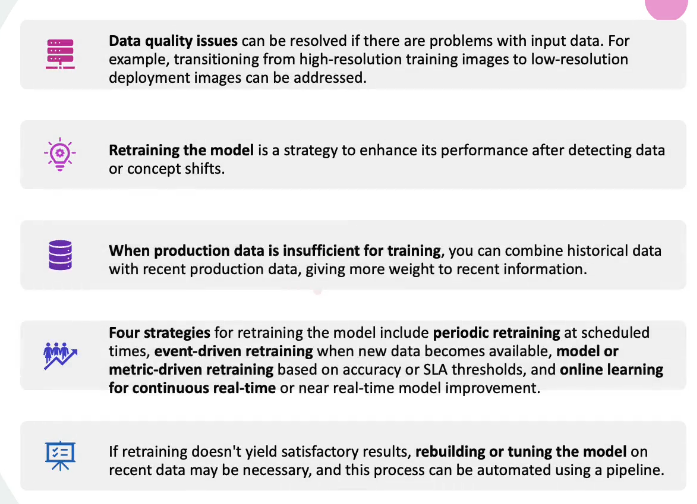

# Monitoring 
Monitoring refers to the continuous process of tracking the behavior of a deployed model so that we can assess its performance.

## Key aspect in a ML System 

* Data: The performance of the ML system is dependent on both the dataset used for training and the ongoing data input received during production 
* Model: The model is the result of applying a ML algorithm to a dataset. It encapsulates the knowledge gained by the algorithm. 
* Code: The code contains the configuration of the model and data. The best performing hyper-parameters are stored. This will highlight the specific model configuration for training, texting and evaluating models.

## Challenges in a ML System

* Entanglements & Configurations - Changes to the input data distribution can significantly affect a model's accuracy and lead to shifts in its predictions, emphasising the important of thorough testing for feature engineering and selection code to account for these effects. 
* Flasw in a model's configuration, including hyper-parameters, versions, can features, can dramatically alter the system's behaviour. Such issues may go unnoticed in traditional software testing, allowing a ML system to generate valid yet incorrect outputs without raising an exceptions. 

## Model Drift
Model drift is a scenario where, a ML model is not performing as per the SLA (Service Level Agreement). Model Performance degrades after deploying it into production, as the model can receive data that was not introduced during training. 

### Three types of Drift in ML
* Data Drift - (also known as feature drift) Data drift highlights the importance of ensuring that the distribution of the training data matches the distribution of the production data to maintain model accuracy.

* Prediction Drift - Prediction drift signifies changes in predictions as input data evolves and it can be addressed through model retraining to maintain accuracy. 

* Concept Shift - Refers to the in relationship between independent and dependent variables. This occurs when the relationship between the independent and dependent variables changes. 

### Techniques to detect drift in ML

Use of basic statistical metrics such as mean, standard deviation, correlation and comparisons of min and max values can gauge drift between training and current independent variables.

Distance measure  (population stability index (PSI), etc...) are suitable for continuous features when assessing drift. 

#### Categorical data

Can use cardinality checks, chi-squared test and entropy.

### Platforms & libraries
These can be used to detect drift
#### Platforms
* WhyLabs 
* Prometheus
* Grafana
#### Libraries
* Deepchecks
* alibi-detect

### Address the drift issues

